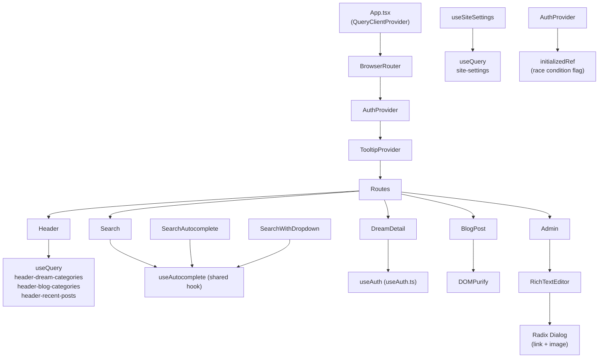

# Design Document — Frontend Hata Düzeltme

## Overview

Bu doküman, `ruya-tabirleri-master` React 18 + TypeScript + Vite + Supabase projesinde tespit edilen 15 frontend hatasının teknik çözüm mimarisini tanımlar. Değişiklikler birbirinden bağımsız, küçük ve güvenli bir şekilde uygulanabilir; her düzeltme kendi gereksinimiyle bire bir eşleşir.

**Teknoloji yığını:**
- React 18.3, TypeScript 5.8, Vite 5.4 (esbuild/swc tabanlı)
- TanStack React Query v5
- Supabase JS v2
- React Router v6
- Radix UI (zaten bağımlılık olarak mevcut)
- Tiptap 3 (RichTextEditor)

---

## Architecture



### Temel Mimari Prensipler

1. **Tek kaynak (single source of truth)**: Her veri her yerde `useQuery` üzerinden önbellekli şekilde çekilir. Duplicate `useEffect`/`fetch` kalıpları kaldırılır.
2. **Determinizm**: Race condition'lar, zaman-bağımlı `setTimeout` yerine `ref` tabanlı bayraklarla önlenir.
3. **Güvenlik önce**: XSS sanitizasyonu en erken noktada (render öncesinde) uygulanır.
4. **Kademeli iyileştirme**: Hiçbir değişiklik mevcut API sözleşmesini bozmaz; bileşen arayüzleri korunur.

---

## Components and Interfaces

### Fix 1 — `useAuth.tsx` Silinmesi

**Etkilenen dosyalar:**
- `src/hooks/useAuth.tsx` → **silinecek**
- `src/hooks/useAuth.ts` → aktif ve korunacak

**Mevcut durum:** İki paralel `useAuth` implementasyonu var. `useAuth.tsx`, kendi `AuthContext`'ini yaratıyor ve `AuthProvider`'ını içeriyor; `useAuth.ts` ise doğru biçimde `src/contexts/auth-context.ts`'deki merkezi context'i tüketiyor.

**Çözüm:** `useAuth.tsx` dosyası silinir. Tüm bileşenlerin `useAuth` importları `src/hooks/useAuth.ts`'e çözümleniyor mu diye `grep` ile doğrulanır.

```typescript
// src/hooks/useAuth.ts (korunacak — değişiklik yok)
import { useContext } from 'react';
import { AuthContext, type AuthContextType } from '@/contexts/auth-context';

export function useAuth(): AuthContextType {
  const context = useContext(AuthContext);
  if (context === undefined) {
    throw new Error('useAuth must be used within an AuthProvider');
  }
  return context;
}
```

**Doğrulama:** `grep -r "from '@/hooks/useAuth'" src/` çıktısında `.tsx` extension görünmez.

---

### Fix 2 — DOMPurify XSS Fix (`BlogPost.tsx`)

**Etkilenen dosyalar:**
- `src/pages/BlogPost.tsx`
- `package.json` (yeni bağımlılıklar)

**Yeni bağımlılıklar:**
```bash
npm install dompurify
npm install -D @types/dompurify
```

**Import paterni:**
```typescript
import DOMPurify from 'dompurify';
```

**Kullanım — render içinde:**
```tsx
// ÖNCE (güvensiz):
dangerouslySetInnerHTML={{ __html: post.content }}

// SONRA (güvenli):
dangerouslySetInnerHTML={{ __html: DOMPurify.sanitize(post.content, {
  ALLOWED_TAGS: [
    'p', 'br', 'strong', 'em', 'u', 's', 'h1', 'h2', 'h3', 'h4', 'h5', 'h6',
    'ul', 'ol', 'li', 'blockquote', 'code', 'pre', 'a', 'img',
    'table', 'thead', 'tbody', 'tr', 'th', 'td', 'hr', 'figure', 'figcaption'
  ],
  ALLOWED_ATTR: ['href', 'src', 'alt', 'class', 'target', 'rel', 'loading'],
  FORBID_TAGS: ['script', 'style', 'iframe'],
  FORBID_ATTR: ['onerror', 'onload', 'onclick', 'onmouseover'],
}) }}
```

**Tasarım kararı:** `ALLOWED_TAGS` listesi, Tiptap editöründe kullanılan tag kümesiyle örtüşür. `script` ve `iframe` explicit olarak yasaklanır. `FORBID_ATTR` ile inline event handler'lar temizlenir.

---

### Fix 3 — `useCallback` Migration Paterni (10 Bileşen)

**Genel Pattern:**

```typescript
// ÖNCE:
useEffect(() => {
  fetchDream();
  // eslint-disable-next-line react-hooks/exhaustive-deps
}, [slug]);

const fetchDream = async () => { ... };

// SONRA:
const fetchDream = useCallback(async () => {
  // aynı implementasyon
}, [slug, user]); // tüm dışsal bağımlılıklar

useEffect(() => {
  fetchDream();
}, [fetchDream]); // eslint-disable-next-line kaldırılır
```

**Bileşen başına bağımlılık tablosu:**

| Dosya | Fonksiyon | useCallback deps |
|-------|-----------|-----------------|
| `DreamDetail.tsx` | `fetchDream` | `[slug, user]` |
| `BlogPost.tsx` | `fetchPost` | `[slug]` |
| `BlogPost.tsx` | `checkIfLiked` | `[post, user]` |
| `Search.tsx` | `performSearch` | `[]` (stable — params içinde alıyor) |
| `Search.tsx` | `fetchRelatedDreams` | `[]` (stable) |
| `CategoryDetail.tsx` | `fetchData` | `[slug]` |
| `Popular.tsx` | `fetchDreams` | `[]` |
| `Favorites.tsx` | `fetchFavorites` | `[user]` |
| `History.tsx` | `fetchHistory` | `[user]` |
| `DreamJournal.tsx` | `fetchJournalEntries` | `[user]` |
| `Profile.tsx` | `fetchProfile` | `[user]` |
| `Blog.tsx` | `fetchPosts` | `[]` |

**`performSearch` özel durumu:** Fonksiyon `[]` deps ile `useCallback`'e sarılır; `searchTerm` parametre olarak alınır (closure değil):

```typescript
const performSearch = useCallback(async (searchTerm: string) => {
  setIsLoading(true);
  try {
    const { data, error } = await supabase.rpc('search_dreams', {
      search_query: searchTerm,
      limit_count: RESULTS_PER_PAGE,
      offset_count: (currentPage - 1) * RESULTS_PER_PAGE,
    });
    // ...
  } finally {
    setIsLoading(false);
  }
}, []); // currentPage fix 6'da ele alınıyor

useEffect(() => {
  if (query) {
    performSearch(query);
  }
}, [query, performSearch]);
```

---

### Fix 4 — RichTextEditor Radix Dialog Tasarımı

**Etkilenen dosya:** `src/components/admin/RichTextEditor.tsx`

**State yapısı:**

```typescript
interface DialogState {
  type: 'link' | 'image' | null;
  value: string;
}

const [dialog, setDialog] = useState<DialogState>({ type: null, value: '' });
```

**Bileşen yapısı (Radix Dialog):**

```tsx
import * as Dialog from '@radix-ui/react-dialog';
import { Input } from '@/components/ui/input';

// Toolbar içinde — Link butonu:
<ToolbarButton
  onClick={() => setDialog({
    type: 'link',
    value: editor.getAttributes('link').href || ''
  })}
  isActive={editor.isActive('link')}
  aria-label="Link Ekle"
  title="Link Ekle"
>
  <LinkIcon className="w-4 h-4" />
</ToolbarButton>

// Dialog bileşeni (editörün dışında, return içinde):
<Dialog.Root
  open={dialog.type !== null}
  onOpenChange={(open) => !open && setDialog({ type: null, value: '' })}
>
  <Dialog.Portal>
    <Dialog.Overlay className="fixed inset-0 bg-black/50 z-50" />
    <Dialog.Content className="fixed left-1/2 top-1/2 -translate-x-1/2 -translate-y-1/2 z-50 bg-background rounded-xl shadow-2xl p-6 w-[400px] max-w-[90vw]">
      <Dialog.Title className="text-lg font-semibold mb-4">
        {dialog.type === 'link' ? 'Link Ekle' : 'Görsel Ekle'}
      </Dialog.Title>

      <Input
        autoFocus
        value={dialog.value}
        onChange={(e) => setDialog(prev => ({ ...prev, value: e.target.value }))}
        placeholder={dialog.type === 'link' ? 'https://...' : 'Görsel URL\'si'}
        onKeyDown={(e) => e.key === 'Enter' && handleDialogConfirm()}
      />

      <div className="flex justify-end gap-2 mt-4">
        <Dialog.Close asChild>
          <Button variant="outline">İptal</Button>
        </Dialog.Close>
        <Button onClick={handleDialogConfirm}>Ekle</Button>
      </div>
    </Dialog.Content>
  </Dialog.Portal>
</Dialog.Root>
```

**`handleDialogConfirm` fonksiyonu:**

```typescript
const handleDialogConfirm = useCallback(() => {
  if (!editor) return;

  if (dialog.type === 'link') {
    if (dialog.value === '') {
      editor.chain().focus().extendMarkRange('link').unsetLink().run();
    } else {
      editor.chain().focus().extendMarkRange('link').setLink({ href: dialog.value }).run();
    }
  } else if (dialog.type === 'image') {
    if (dialog.value) {
      editor.chain().focus().setImage({ src: dialog.value }).run();
    }
  }

  setDialog({ type: null, value: '' });
}, [editor, dialog]);
```

**Kaldırılan kod:** `window.prompt` çağrıları tamamen silinir. Eski `setLink` ve `addImage` `useCallback` fonksiyonları, yeni dialog state güncellemeleriyle değiştirilir.

---

### Fix 5 — Header React Query Migration

**Etkilenen dosya:** `src/components/layout/Header.tsx`

**Eklenecek import:**
```typescript
import { useQuery } from '@tanstack/react-query';
```

**Kaldırılacak:** `fetchAll` async fonksiyonu içeren `useEffect` bloğu ve `categories`, `blogCategories`, `recentPosts` için `useState` tanımları.

**Yeni useQuery hook'ları:**

```typescript
const STALE_5_MIN = 5 * 60 * 1000; // 300_000 ms

const { data: categories = [] } = useQuery({
  queryKey: ['header-dream-categories'],
  queryFn: async () => {
    const { data, error } = await supabase
      .from('categories')
      .select('id, name, slug, icon')
      .limit(50);
    if (error) throw error;
    return [...(data || [])].sort((a, b) =>
      a.name.localeCompare(b.name, 'tr', { sensitivity: 'base' })
    );
  },
  staleTime: STALE_5_MIN,
});

const { data: blogCategories = [] } = useQuery({
  queryKey: ['header-blog-categories'],
  queryFn: async () => {
    const { data, error } = await supabase
      .from('blog_categories')
      .select('id, name, slug, description, icon, order_index, created_at, updated_at')
      .order('order_index', { ascending: true })
      .order('name', { ascending: true })
      .limit(20);
    if (error) throw error;
    return (data || []) as BlogCategory[];
  },
  staleTime: STALE_5_MIN,
});

const { data: recentPosts = [] } = useQuery({
  queryKey: ['header-recent-posts'],
  queryFn: async () => {
    const { data, error } = await supabase
      .from('blog_posts')
      .select('id, title, slug, featured_image, category:blog_categories(id, name, slug, description, icon, order_index, created_at, updated_at)')
      .eq('is_published', true)
      .order('created_at', { ascending: false })
      .limit(4);
    if (error) throw error;
    return (data || []) as unknown as BlogPostPreview[];
  },
  staleTime: STALE_5_MIN,
});
```

**Tasarım kararı:** `staleTime: 300_000` ile Header her mount'ta yeni istek atmaz. React Query varsayılan olarak `refetchOnWindowFocus: true` tutar, bu davranış siteye dönüşlerde kategori listelerini güncel tutar. `throwOnError` açılmaz; hata durumunda empty array fallback yeterli.

---

### Fix 6 — Search Server-Side Pagination

**Etkilenen dosya:** `src/pages/Search.tsx`

**Değişen state'ler:**

```typescript
const [totalCount, setTotalCount] = useState(0); // yeni — toplam sonuç sayısı
// results state aynı kalır, ama artık sadece mevcut sayfa verisi tutar
```

**Yeni `performSearch` fonksiyonu:**

```typescript
const performSearch = useCallback(async (searchTerm: string, page: number = 1) => {
  setIsLoading(true);
  try {
    const offset = (page - 1) * RESULTS_PER_PAGE;

    // Sayfa verisi
    const { data, error } = await supabase.rpc('search_dreams', {
      search_query: searchTerm,
      limit_count: RESULTS_PER_PAGE,
      offset_count: offset,      // yeni parametre
    });
    if (error) throw error;

    setResults((data as DreamSearchResult[]) || []);
    setCurrentPage(page);

    // Toplam sayı (hafif sorgu)
    const { count } = await supabase
      .from('dreams')
      .select('id', { count: 'exact', head: true })
      .eq('is_published', true)
      .textSearch('title', searchTerm);          // ya da RPC'nin döndürdüğü total_count

    setTotalCount(count || 0);
    saveRecentSearch(searchTerm);
  } catch (error) {
    console.error('Search error:', error);
    setResults([]);
  } finally {
    setIsLoading(false);
  }
}, []); // currentPage dışarıdan parametre geliyor
```

**Sayfa geçişi:**

```typescript
// Pagination butonları artık performSearch çağırır:
onClick={() => performSearch(query, currentPage - 1)}
onClick={() => performSearch(query, currentPage + 1)}
```

**Toplam sayfa hesabı:**

```typescript
const totalPages = Math.ceil(totalCount / RESULTS_PER_PAGE);
```

**RPC için gerekli Supabase migration:**

```sql
-- Mevcut search_dreams fonksiyonuna offset parametresi ekleme
CREATE OR REPLACE FUNCTION search_dreams(
  search_query text,
  limit_count integer DEFAULT 24,
  offset_count integer DEFAULT 0   -- YENİ parametre
)
RETURNS TABLE(...) AS $$
BEGIN
  RETURN QUERY
    SELECT ... FROM dreams
    WHERE ... -- FTS koşulları
    ORDER BY rank DESC
    LIMIT limit_count
    OFFSET offset_count;           -- YENİ
END;
$$ LANGUAGE plpgsql;
```

**Önemli not:** Client-side `filteredResults` ve `paginatedResults` `useMemo`'ları kaldırılır. Filtreler (kategori, minViews, minLikes) bu aşamada "client-side limitation" notu ile korunur; sonraki iteration'da RPC parametrelerine taşınabilir.

---

### Fix 7 — AuthProvider Race Condition Fix

**Etkilenen dosya:** `src/contexts/AuthProvider.tsx`

**Mevcut sorun:** `getSession` ve `onAuthStateChange` aynı anda ateşlenebilir; her ikisi de `fetchProfile` ve `fetchRoles`'u tetikler → duplicate Supabase istekleri.

**Çözüm — `initializedRef` bayrağı:**

```typescript
import { useState, useEffect, useRef, ReactNode } from 'react';

export function AuthProvider({ children }: { children: ReactNode }) {
  const [user, setUser] = useState<AuthContextType['user']>(null);
  const [session, setSession] = useState<AuthContextType['session']>(null);
  const [profile, setProfile] = useState<Profile | null>(null);
  const [roles, setRoles] = useState<AppRole[]>([]);
  const [isLoading, setIsLoading] = useState(true);

  // Race condition flag: ilk başarılı başlatma tamamlandıktan sonra true olur
  const initializedRef = useRef(false);
  // Mevcut kullanıcı ID'sini takip et — aynı userId için tekrar fetch engelle
  const currentUserIdRef = useRef<string | null>(null);

  useEffect(() => {
    // ADIM 1: Önce listener kur (Supabase önerisi)
    const { data: { subscription } } = supabase.auth.onAuthStateChange((_event, session) => {
      setSession(session);
      setUser(session?.user ?? null);

      if (session?.user) {
        // Sadece userId değiştiyse fetch yap
        if (currentUserIdRef.current !== session.user.id) {
          currentUserIdRef.current = session.user.id;
          fetchProfile(session.user.id);
          fetchRoles(session.user.id);
        }
      } else {
        currentUserIdRef.current = null;
        setProfile(null);
        setRoles([]);
        setIsLoading(false);
      }
    });

    // ADIM 2: Sonra mevcut session'ı kontrol et
    supabase.auth.getSession().then(({ data: { session } }) => {
      setSession(session);
      setUser(session?.user ?? null);

      if (session?.user) {
        // onAuthStateChange zaten handle ettiyse tekrar fetch yapma
        if (currentUserIdRef.current !== session.user.id) {
          currentUserIdRef.current = session.user.id;
          fetchProfile(session.user.id);
          fetchRoles(session.user.id);
        }
      } else {
        setIsLoading(false);
      }

      initializedRef.current = true;
    });

    return () => subscription.unsubscribe();
  }, []);

  // fetchProfile ve fetchRoles değişmez (aşağıda)
  // ...
}
```

**Kaldırılan anti-pattern:** `setTimeout(..., 0)` deduplication (`useAuth.tsx`'in yaklaşımı) tamamen ortadan kalkar. `initializedRef` ve `currentUserIdRef` deterministic çözüm sunar.

---

### Fix 8 — BlogPost `finally` Bloğu

**Etkilenen dosya:** `src/pages/BlogPost.tsx`

**Mevcut sorun:** `fetchPost` fonksiyonunda `setIsLoading(false)` sadece başarı yolunda çağrılıyor; hata durumunda `isLoading` sonsuza kadar `true` kalıyor.

**Çözüm:**

```typescript
const fetchPost = useCallback(async () => {
  setIsLoading(true);
  // isMounted ref unmount sonrası state update'ini engeller
  let isMounted = true;

  try {
    const { data, error } = await supabase
      .from('blog_posts')
      .select(`*, category:blog_categories(id, name, slug, icon)`)
      .eq('slug', slug)
      .eq('is_published', true)
      .maybeSingle();

    if (!isMounted) return;

    if (error || !data) {
      navigate('/blog');
      return;
    }

    // ... mevcut veri işleme mantığı ...

  } catch (err) {
    if (isMounted) {
      console.error('fetchPost error:', err);
      navigate('/blog');
    }
  } finally {
    if (isMounted) setIsLoading(false);  // HER DURUMDA çalışır
  }

  return () => { isMounted = false; };
}, [slug, navigate]);

useEffect(() => {
  if (slug) fetchPost();
}, [slug, fetchPost]);
```

---

### Fix 9 — A11y Düzeltmeleri

**Etkilenen dosyalar:** `Header.tsx`, `SearchAutocomplete.tsx`, `RichTextEditor.tsx`

#### 9a. Header — `aria-current` ve `aria-expanded`

```tsx
// Navigasyon linklerinde:
<Link
  to="/"
  aria-current={isActiveLink('/') ? 'page' : undefined}
  // ...
>

// Dropdown butonlarında (zaten mevcut, doğrulanacak):
<button
  aria-expanded={openCategoryMenu}  // boolean — mevcut
  // ...
>
<button
  aria-expanded={openBlogMega}      // boolean — mevcut
  // ...
>
```

#### 9b. SearchAutocomplete — ARIA Rolleri

```tsx
// Dropdown container:
<div
  role="listbox"
  aria-label="Arama önerileri"
  id="search-suggestions"
  // ...
>

// Her öneri butonu:
<button
  role="option"
  aria-selected={selectedIndex === index}
  // ...
>

// Input üzerinde:
<Input
  aria-expanded={showDropdownContent}
  aria-autocomplete="list"
  aria-controls="search-suggestions"
  // ...
/>
```

#### 9c. RichTextEditor — `aria-label`

```tsx
// Her ToolbarButton'a aria-label eklenir.
// title prop zaten mevcut; aria-label ile eşleştirilir:
<ToolbarButton
  aria-label="Kalın"
  title="Kalın"
  // ...
>

// ToolbarButton bileşeninin interface'i güncellenir:
interface ToolbarButtonProps {
  onClick: () => void;
  isActive?: boolean;
  disabled?: boolean;
  children: React.ReactNode;
  title?: string;
  'aria-label'?: string;  // YENİ
}

// button elementine iletilir:
<button
  type="button"
  aria-label={props['aria-label'] || props.title}
  // ...
>
```

---

### Fix 10 — `useSiteSettings` React Query Migration

**Etkilenen dosya:** `src/hooks/useSiteSettings.ts`

**Kaldırılan kod:**
```typescript
// Bu satırlar kaldırılır:
let cache: { data: SiteSettings | null; ts: number } | null = null;
const CACHE_TTL = 60_000;
```

**Yeni implementasyon:**

```typescript
import { useQuery, useQueryClient } from '@tanstack/react-query';

const SITE_SETTINGS_QUERY_KEY = ['site-settings'] as const;
const STALE_60_SEC = 60_000;

export function useSiteSettings() {
  const { data: settings = defaults, isLoading: loading } = useQuery({
    queryKey: SITE_SETTINGS_QUERY_KEY,
    queryFn: async (): Promise<SiteSettings> => {
      const { data, error } = await supabase
        .from('site_settings')
        .select('key, value');

      if (error) throw error;

      const merged: SiteSettings = { ...defaults };
      data?.forEach((row: { key: string; value: unknown }) => {
        if (row.key in merged && row.value !== null && row.value !== undefined) {
          (merged as unknown as Record<string, unknown>)[row.key] = row.value as string;
        }
      });
      return merged;
    },
    staleTime: STALE_60_SEC,
  });

  return { settings, loading };
}

// Admin paneli için cache invalidation
export function useInvalidateSiteSettings() {
  const queryClient = useQueryClient();
  return () => queryClient.invalidateQueries({ queryKey: SITE_SETTINGS_QUERY_KEY });
}

// Eski API uyumluluğu için (tüm import'ları kırmamak adına)
export function invalidateSiteSettingsCache() {
  // Bu fonksiyon artık sadece hook içinden çağrılabilir;
  // Admin bileşenleri useInvalidateSiteSettings'e migrate edilmeli.
  console.warn('invalidateSiteSettingsCache deprecated — use useInvalidateSiteSettings()');
}
```

---

### Fix 11 — Supabase Env Validation

**Etkilenen dosya:** `src/integrations/supabase/client.ts`

```typescript
import { createClient } from '@supabase/supabase-js';
import type { Database } from './types';

const SUPABASE_URL = import.meta.env.VITE_SUPABASE_URL as string | undefined;
const SUPABASE_PUBLISHABLE_KEY = import.meta.env.VITE_SUPABASE_PUBLISHABLE_KEY as string | undefined;

if (!SUPABASE_URL || SUPABASE_URL.trim() === '') {
  throw new Error('VITE_SUPABASE_URL ortam değişkeni tanımlı değil.');
}

if (!SUPABASE_PUBLISHABLE_KEY || SUPABASE_PUBLISHABLE_KEY.trim() === '') {
  throw new Error('VITE_SUPABASE_PUBLISHABLE_KEY ortam değişkeni tanımlı değil.');
}

export const supabase = createClient<Database>(SUPABASE_URL, SUPABASE_PUBLISHABLE_KEY, {
  auth: {
    storage: localStorage,
    persistSession: true,
    autoRefreshToken: true,
  },
});
```

**Tasarım kararı:** `throw new Error` module seviyesinde atılır. Vite, bu hatayı uygulama başlatılırken tarayıcı konsoluna açık bir şekilde gösterir. Güvenlik açısından URL ve key değerleri hata mesajına dahil edilmez.

---

### Fix 12 — Route Redirect

**Etkilenen dosya:** `src/App.tsx`

```tsx
import { Routes, Route, Navigate, useLocation } from 'react-router-dom';

// AnimatedRoutes içinde:
<Routes location={location}>
  {/* Canonical route */}
  <Route path="/populer" element={<Popular />} />

  {/* Redirect — replace=true ile history stack'e eklenmez */}
  <Route path="/ruya-tabirleri" element={<Navigate replace to="/populer" />} />

  {/* Diğer route'lar değişmez */}
</Routes>
```

---

### Fix 13 — Vite Console Drop Konfigürasyonu

**Etkilenen dosya:** `vite.config.ts`

```typescript
export default defineConfig(({ mode }) => ({
  // ...mevcut config...
  build: {
    // ...mevcut build config...
    minify: 'esbuild',
    terserOptions: undefined,  // esbuild kullanılıyor
  },
  esbuild: {
    // Production build'de tüm console.* çağrıları kaldırılır
    drop: mode === 'production' ? ['console', 'debugger'] : [],
  },
  // ...
}));
```

**Merkezileştirilmiş logger utility (opsiyonel — Gereksinim 13.3):**

```typescript
// src/lib/logger.ts
const isDev = import.meta.env.DEV;

export const logger = {
  error: isDev ? console.error.bind(console) : () => {},
  warn: isDev ? console.warn.bind(console) : () => {},
  info: isDev ? console.info.bind(console) : () => {},
};
```

**Tasarım kararı:** `esbuild.drop: ['console']` en temiz çözümdür — build sırasında tüm `console.*` çağrılarını kaldırır, çalışma zamanı kontrolü gerektirmez. Logger utility ise kritik catch bloklarının dev'de görünür kalması için tamamlayıcıdır.

---

### Fix 14 — `useAutocomplete` Shared Hook

**Yeni dosya:** `src/hooks/useAutocomplete.ts`

```typescript
import { useState, useCallback, useRef } from 'react';
import { supabase } from '@/integrations/supabase/client';

export interface AutocompleteSuggestion {
  id: string;
  title: string;
  slug: string;
  category_name?: string;
  view_count?: number;
}

const DEBOUNCE_MS = 250;
const MIN_CHARS = 2;
const DEFAULT_LIMIT = 8;

interface UseAutocompleteOptions {
  limit?: number;
}

export function useAutocomplete(
  searchTerm: string,
  options: UseAutocompleteOptions = {}
) {
  const { limit = DEFAULT_LIMIT } = options;
  const [suggestions, setSuggestions] = useState<AutocompleteSuggestion[]>([]);
  const [isLoading, setIsLoading] = useState(false);
  const debounceRef = useRef<ReturnType<typeof setTimeout>>();

  const search = useCallback(async (term: string) => {
    // Boş string veya min karakter altında — boş döndür
    if (!term || term.length < MIN_CHARS) {
      setSuggestions([]);
      return;
    }

    setIsLoading(true);
    try {
      const { data } = await supabase
        .from('dreams')
        .select(`
          id,
          title,
          slug,
          view_count,
          categories:category_id (name)
        `)
        .eq('is_published', true)
        .ilike('title', `%${term}%`)
        .order('view_count', { ascending: false })
        .limit(limit);

      if (data) {
        setSuggestions(
          data.map((d) => ({
            id: d.id,
            title: d.title,
            slug: d.slug,
            view_count: d.view_count ?? undefined,
            category_name: (d.categories as { name?: string })?.name || undefined,
          }))
        );
      }
    } catch (error) {
      console.error('useAutocomplete error:', error);
      setSuggestions([]);
    } finally {
      setIsLoading(false);
    }
  }, [limit]);

  // Debounced araç — bileşen bu fonksiyonu kullanır
  const debouncedSearch = useCallback((term: string) => {
    if (debounceRef.current) clearTimeout(debounceRef.current);
    debounceRef.current = setTimeout(() => search(term), DEBOUNCE_MS);
  }, [search]);

  return { suggestions, isLoading, search: debouncedSearch, setSuggestions };
}
```

**Tüketen bileşenler:**

- `src/components/search/SearchAutocomplete.tsx` — `searchSuggestions` fonksiyonu kaldırılır, `useAutocomplete` import edilir
- `src/components/search/SearchWithDropdown.tsx` — aynı şekilde
- (3. dosya gereksinim belgesi 14.4'te "three files" der; `SearchAutocomplete` ve `SearchWithDropdown` tespit edildi; geliştirme sırasında 3. dosya için `grep -r "ilike.*title" src/` ile doğrulanmalıdır)

**SearchAutocomplete'te kullanım:**

```typescript
// ÖNCE:
const searchSuggestions = useCallback(async (searchQuery: string) => {
  // 30 satır duplicate kod
}, []);

// SONRA:
const { suggestions, isLoading, search: searchSuggestions, setSuggestions } = useAutocomplete(query);
```

---

### Fix 15 — BrowserRouter Sıralama

**Etkilenen dosya:** `src/App.tsx`

**Mevcut sıralama (yanlış):**
```tsx
<QueryClientProvider client={queryClient}>
  <AuthProvider>           {/* ❌ BrowserRouter'dan önce */}
    <TooltipProvider>
      <BrowserRouter>      {/* ❌ AuthProvider içinde */}
        <AnimatedRoutes />
      </BrowserRouter>
    </TooltipProvider>
  </AuthProvider>
</QueryClientProvider>
```

**Doğru sıralama:**
```tsx
const App = () => (
  <QueryClientProvider client={queryClient}>
    <BrowserRouter future={{ v7_startTransition: true, v7_relativeSplatPath: true }}>
      <AuthProvider>
        <TooltipProvider>
          <Toaster />
          <Sonner />
          <OfflineIndicator />
          <CommandPalette />
          <OnboardingTour />
          <InstallPrompt />
          <AnimatedRoutes />
        </TooltipProvider>
      </AuthProvider>
    </BrowserRouter>
  </QueryClientProvider>
);
```

**Sıralama kuralı:** `QueryClientProvider` (en dış) → `BrowserRouter` → `AuthProvider` → `TooltipProvider` → uygulama bileşenleri.

**Tasarım kararı:** `AuthProvider` artık `useNavigate` veya diğer Router hook'larını doğrudan kullanabilir. Mevcut `AuthProvider.tsx` kodunda `useNavigate` çağrısı yok ama gelecekteki auth redirect gereksinimleri için (örn. session expire sonrası `/giris`'e yönlendirme) bu sıralama zorunludur.

---

## Data Models

### Değişen Tipler

**`DialogState` (Fix 4 — RichTextEditor):**
```typescript
interface DialogState {
  type: 'link' | 'image' | null;
  value: string;  // mevcut URL değeri (önceden doldurmak için)
}
```

**`AutocompleteSuggestion` (Fix 14 — useAutocomplete):**
```typescript
// src/hooks/useAutocomplete.ts içine taşınır (duplicate tanım kaldırılır)
interface AutocompleteSuggestion {
  id: string;
  title: string;
  slug: string;
  category_name?: string;
  view_count?: number;
}
```

**`Search.tsx` state değişiklikleri (Fix 6):**
```typescript
// Kaldırılan:
// results artık sadece mevcut sayfa verisi (slice değil)

// Eklenen:
const [totalCount, setTotalCount] = useState(0);

// Kaldırılan useMemo'lar:
// paginatedResults — artık results direkt sayfa verisi
// totalPages — totalCount / RESULTS_PER_PAGE'den hesaplanır
```

---

## Correctness Properties

*A property is a characteristic or behavior that should hold true across all valid executions of a system — essentially, a formal statement about what the system should do. Properties serve as the bridge between human-readable specifications and machine-verifiable correctness guarantees.*

---

### Property 1: DOMPurify sanitizasyonu XSS payload'larını temizler

*For any* HTML string containing `<script>` tags, inline event handlers (`onerror`, `onload`, `onclick`), or `javascript:` protocol URLs, calling `DOMPurify.sanitize(html, config)` with the defined configuration SHALL return a string that contains none of those dangerous elements.

**Validates: Requirements 2.1, 2.2**

---

### Property 2: Sanitizasyon güvenli içeriği korur

*For any* HTML string composed entirely of allowed tags (`p`, `strong`, `em`, `a`, `img`, `ul`, `ol`, `li`, `blockquote`, `code`, `h1`-`h6`), `DOMPurify.sanitize(html, config)` SHALL return a string whose text content is identical to the input's text content.

**Validates: Requirements 2.3**

---

### Property 3: Sayfalama offset formülü doğrudur

*For any* positive integer page number `N` and `RESULTS_PER_PAGE` value `R`, the search RPC SHALL be called with `limit_count = R` and `offset_count = (N - 1) * R`.

**Validates: Requirements 6.1, 6.2**

---

### Property 4: AuthProvider duplicate fetch engellenir

*For any* sequence of concurrent `getSession` and `onAuthStateChange` events that return the same `userId`, `fetchProfile` and `fetchRoles` SHALL each be called at most once during the initialization sequence.

**Validates: Requirements 7.2, 7.3**

---

### Property 5: Env validation her falsy değeri reddeder

*For any* value of `VITE_SUPABASE_URL` that is `undefined`, `null`, or an empty string (including whitespace-only strings), the Supabase client module SHALL throw an `Error` before `createClient` is invoked.

**Validates: Requirements 11.1, 11.3**

---

### Property 6: useAutocomplete boş sorgu için istek atmaz

*For any* `searchTerm` whose trimmed length is less than `MIN_CHARS` (2), `useAutocomplete` SHALL return an empty suggestions array without issuing a Supabase request.

**Validates: Requirements 14.5**

---

### Property 7: useAutocomplete sonuçları arama terimiyle eşleşir

*For any* non-empty `searchTerm` of length ≥ 2, every suggestion returned by `useAutocomplete` SHALL have a `title` that contains the `searchTerm` (case-insensitive).

**Validates: Requirements 14.2**

---

## Error Handling

| Senaryo | Mevcut Davranış | Hedef Davranış |
|---------|----------------|----------------|
| `fetchPost` Supabase hatası | `isLoading` sonsuza kalır | `finally` ile `setIsLoading(false)` garantili |
| `fetchPost` unmount sonrası tamamlanma | `setIsLoading` çağrılır → memory leak | `isMounted` ref ile engellenir |
| Header sorgu hatası | Unhandled rejection | React Query `onError` → empty array fallback |
| `useSiteSettings` hatası | `console.error` + defaults | React Query `useQuery` → `data = defaults` |
| Env değişkeni eksik | `createClient` `undefined` argümanla çalışır | Module load sırasında `throw Error` |
| Search RPC offset parametresi yoksa | Build başarısız olmaz, 0'a fallback | Supabase migration zorunlu (Gereksinim 6.6) |
| DOMPurify import'u fail olursa | XSS açığı olur | `dompurify` production dep; build'de bulunur |

---

## Testing Strategy

### Yaklaşım

**Unit testler:** Belirli örnekler, edge case'ler ve hata koşulları için. Çok fazla unit test yazılmaz — property testleri geniş input alanını kapsar.

**Property testler:** Evrensel özellikler için en az 100 iterasyonla çalıştırılır. Kütüphane: `fast-check` (TypeScript için standart PBT kütüphanesi).

```bash
npm install -D fast-check vitest @testing-library/react @testing-library/user-event
```

### Property Test Konfigürasyonu

Her property testi tag formatı:
```typescript
// Feature: frontend-hata-duzeltme, Property N: <property metni>
```

**Property 1 ve 2 — DOMPurify testleri:**

```typescript
// Feature: frontend-hata-duzeltme, Property 1: DOMPurify XSS temizleme
import fc from 'fast-check';
import DOMPurify from 'dompurify';
import { JSDOM } from 'jsdom';

const window = new JSDOM('').window;
const purify = DOMPurify(window);

it('Property 1: DOMPurify her XSS payload için tehlikeli içeriği siler', () => {
  fc.assert(
    fc.property(
      fc.string(),  // rastgele string
      (payload) => {
        // İçine script tagi göm
        const html = `<p>Güvenli</p><script>${payload}</script><p onerror="${payload}">Test</p>`;
        const result = purify.sanitize(html, {
          FORBID_TAGS: ['script'],
          FORBID_ATTR: ['onerror', 'onload', 'onclick'],
        });
        return !result.includes('<script') && !result.includes('onerror=');
      }
    ),
    { numRuns: 200 }
  );
});
```

**Property 3 — Sayfalama offset doğruluğu:**

```typescript
// Feature: frontend-hata-duzeltme, Property 3: Sayfalama offset formülü
it('Property 3: Her sayfa için offset doğru hesaplanır', () => {
  fc.assert(
    fc.property(
      fc.integer({ min: 1, max: 1000 }),  // sayfa numarası
      fc.integer({ min: 1, max: 100 }),   // RESULTS_PER_PAGE
      (page, resultsPerPage) => {
        const offset = (page - 1) * resultsPerPage;
        return offset >= 0 && offset === (page - 1) * resultsPerPage;
      }
    ),
    { numRuns: 500 }
  );
});
```

**Property 5 — Env validation:**

```typescript
// Feature: frontend-hata-duzeltme, Property 5: Env validation
it('Property 5: Falsy env değerleri için createClient çağrılmaz', () => {
  fc.assert(
    fc.property(
      fc.oneof(fc.constant(''), fc.constant('  '), fc.constant(undefined)),
      (badValue) => {
        expect(() => validateSupabaseEnv(badValue as string, 'valid-key')).toThrow();
        expect(() => validateSupabaseEnv('valid-url', badValue as string)).toThrow();
      }
    ),
    { numRuns: 50 }
  );
});
```

**Property 6 ve 7 — useAutocomplete:**

```typescript
// Feature: frontend-hata-duzeltme, Property 6: Boş sorgu için istek yok
// Feature: frontend-hata-duzeltme, Property 7: Sonuçlar arama terimiyle eşleşir
it('Property 6: MIN_CHARS altında istek atılmaz', () => {
  fc.assert(
    fc.property(
      fc.string({ maxLength: 1 }),  // 0 veya 1 karakter
      (shortTerm) => {
        const fetchSpy = vi.fn();
        // Hook test — boş sonuç, sıfır fetch
        const { result } = renderHook(() => useAutocomplete(shortTerm));
        expect(result.current.suggestions).toEqual([]);
        expect(fetchSpy).not.toHaveBeenCalled();
      }
    ),
    { numRuns: 100 }
  );
});
```

### Unit Test Odak Alanları

1. **Fix 1:** `useAuth.tsx`'in silinmesi sonrası tüm import'ların derlenmesi
2. **Fix 4:** Dialog açılma/kapanma, boş URL ile link silme davranışı
3. **Fix 7:** `currentUserIdRef` deduplication — aynı userId ile iki event gelirse tek fetch
4. **Fix 8:** `fetchPost` hata senaryosunda `isLoading = false` ve navigate çağrısı
5. **Fix 9:** ARIA attribute'larının varlığı (render testleri)
6. **Fix 12:** `/ruya-tabirleri` → `/populer` redirect davranışı ve `replace` flag

### Entegrasyon Test Odak Alanları

1. **Fix 5:** Header React Query — `staleTime` içinde ikinci mount → 0 ek Supabase isteği
2. **Fix 6:** Search sayfalama — sayfa 2'de doğru offset ile RPC çağrısı
3. **Fix 10:** Birden fazla `useSiteSettings` instance → tek Supabase isteği
4. **Fix 11:** Env eksikken Vite build veya dev server açık mesajla durur

### Test Komutu

```bash
npx vitest --run  # single execution (watch mode değil)
```
